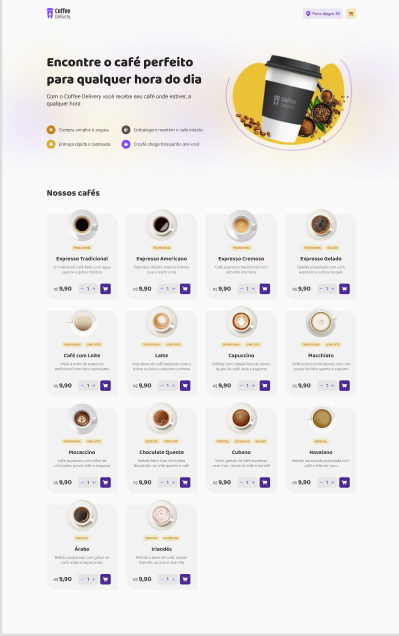
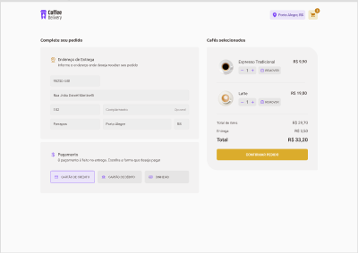
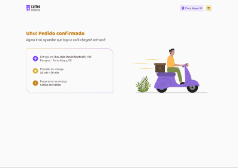

<h1 align="center">


</h1>


<p align="center">
  Coffee Delivery - Ecommerce de café 📰🚀
  <br>
  <br>


</p>

---

<p align="center">
  <a href="#dart-sobre">Sobre</a> &#xa0; | &#xa0; 
  <a href="#rocket-tecnologias">Tecnologias</a> &#xa0; | &#xa0;
  <a href="#white_check_mark-requerimentos">Requerimentos</a> &#xa0; | &#xa0;
  <a href="#checkered_flag-começando">Começando</a> &#xa0; &#xa0; 
 
</p>

<br>


## :dart: Sobre ##


O Projeto Coffe Delivery é um projeto para gerenciar um carrinho de compras de uma cafeteria fictícia, que contém as seguintes funcionalidades:

- Listagem de produtos (cafés) disponíveis para compra
- Adicionar uma quantidade específicas de itens no carrinho
- Aumentar ou remover a quantidade de itens no carrinho
- Formulário para o usuário preencher o seu endereço
- Exibir o total de itens no carrinho no Header
- Exibir o valor total da soma de itens no carrinho multiplicados pelo valor.

<br>


## 🧪 Tecnologias ##

As seguintes tecnologias foram utilizadas no projeto:

- [React](https://react.org/)
- [Styled-componets](https://styled-components.com/)
- [typescript](https://www.typescriptlang.org/)


## :checkered_flag: Começando ##

```bash
# Clone this project
$ git clone https://github.com/thiagofreitascarneiro/coffeeDelivery
# Access
$ cd coffeeDelivery
# Install dependencies
$ npm install
# Run the project
$ npm run dev
# The server will initialize in the <http://localhost:3000>
```
## :framed_picture: Figma ##

- [Figma](https://www.figma.com/file/NUsdanD7sLBKRiN8Edha6c/Coffee-Delivery-(Copy)?t=R2V9yHCDrUQeMVRG-0)


</br>

